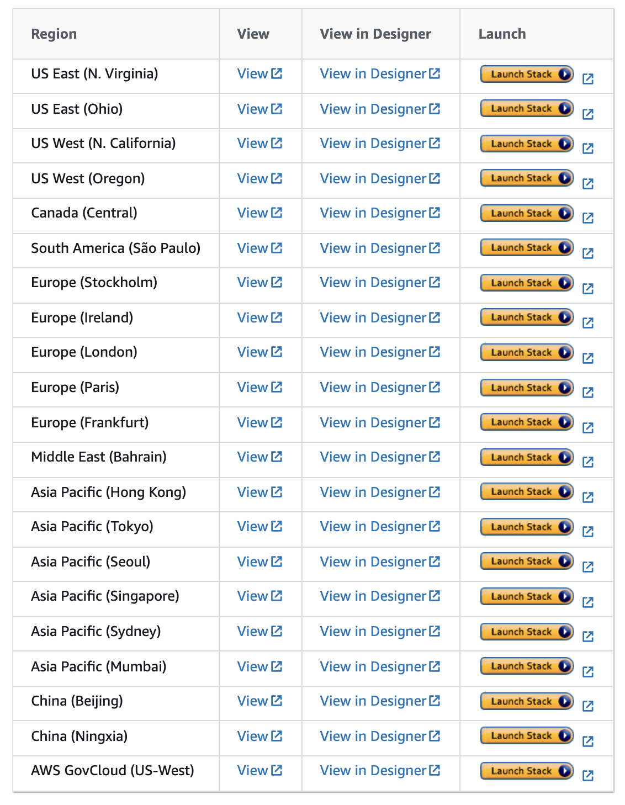

## Neptune ML Toolkit

The Neptune ML Toolkit is a python library for developing models for machine learning on graphs with [Amazon Neptune ML](https://aws.amazon.com/neptune/machine-learning/), a feature of [Amazon Neptune](https://aws.amazon.com/neptune/).
Amazon Neptune ML makes it possible to automatically train and deploy graph machine learning models to help find hidden patterns and extract useful insights from your heterogeneous graph data stored in the Amazon Neptune Graph Database.
Amazon Neptune ML uses Deep Graph Library ([DGL](https://www.dgl.ai/)) and [Amazon SageMaker](https://aws.amazon.com/sagemaker/) to build and train Graph Neural Networks (GNNs), a machine learning technique purpose-built for graphs, for tasks such as Node Classification/Regression, Link Prediction or Edge Classification.
See the [Neptune ML documentation](https://docs.aws.amazon.com/neptune/latest/userguide/machine-learning.html) page to learn more.

With this toolkit, you can [develop custom models](https://docs.aws.amazon.com/neptune/latest/userguide/machine-learning-custom-models.html) to be used with Amazon Neptune ML, using DGL and other python libraries.
The toolkit contains [examples](./examples) of custom model implementations and a model zoo with DGL implementations for popular heterogeneous graph models.

## Getting Started
The fastest way to get started is to use the Neptune ML [AWS CloudFormation quick start tempalates](https://docs.aws.amazon.com/neptune/latest/userguide/machine-learning.html#machine-learning-quick-start).
Launching the template installs all necessary components, including a Neptune DB cluster and a Jupyter Notebook instance, with the Neptune ML Toolkit preinstalled.

Follow the instructions to finish setting the cloud formation stack and then navigate to the SageMaker notebook with the Neptune ML Toolkit pre-installed to begin exploring your graph data and developing models.

### Local installation
To use the Neptune ML toolkit in a local environment you can clone the repo by running:

* `git clone https://github.com/awslabs/neptuneml-toolkit.git`

Create a conda environment with all the requirements by running the following commands:

* `conda env create -f environment.cpu.yml` if you do **not** have a cuda gpu device available
or
* `conda env create -f environment.gpu.yml` if you have a cuda gpu device and would like to use it for model development

Activate the environment by running

* `conda activate neptune_ml_p36`

and then install the package using pip

* `pip install neptuneml-toolkit`

## Security

See [CONTRIBUTING](CONTRIBUTING.md#security-issue-notifications) for more information.

## License

This project is licensed under the Apache-2.0 License.

